  

  <a href="./README.md">Русский</a> · <strong>English</strong> · <a href="https://github.com/mrjakeball">GitHub profile</a>

# Projects you can step into

This is not a screenshot archive. Every cover opens a dedicated showcase repository with a compact gallery, important flows, engineering decisions and honest unfinished edges.

  
  
  
  
  

> [!NOTE]
> These are public project showcases, not copies of private repositories. Source code is published separately only after preparation and review.

## Available now

Two projects with a direct way into the product: a mobile PWA and a Telegram bot.

<strong>LIVE · MOBILE PWA · FITNESS</strong>

### TEMPO PULSE

Keeps workouts, nutrition, sleep, hydration and progress in one mobile flow. Local data and offline-first behaviour keep the core experience available without a permanent connection.

  

  <a href="https://github.com/mrjakeball/tempo-pulse-showcase"><strong>Open showcase →</strong></a>
  &nbsp;·&nbsp;
  <a href="https://tempo-fitness-pwa.pages.dev/"><strong>Launch PWA ↗</strong></a>

 

---

<strong>LIVE · TELEGRAM · ORDERS</strong>

### X‑TREME Shop Bot

Guides a user from product links and options to delivery and fee estimates. It finishes by preparing a structured request for an operator.

  

  <a href="https://github.com/mrjakeball/xtreme-shop-bot-showcase"><strong>Open showcase →</strong></a>
  &nbsp;·&nbsp;
  <a href="https://t.me/XtremeShopBot"><strong>Open bot ↗</strong></a>

 

## Interfaces that do real work

An educational editor and a commerce checkout: two complete user journeys.

<strong>LEARNING · PYTHON IN THE BROWSER</strong>

### Kodograf VVGU

A lesson, Monaco editor and real Pyodide-powered Python execution share one screen. A Web Worker isolates execution so practice does not freeze the interface.

  

  <a href="https://github.com/mrjakeball/kodograf-vvgu-showcase"><strong>Open showcase →</strong></a>

 

---

<strong>PRODUCT FLOW · E-COMMERCE</strong>

### Pashtel

The responsive bakery storefront leads from catalogue and cart through a five-step checkout. The server recalculates the total and validates the order data again.

  

  <a href="https://github.com/mrjakeball/pashtel-showcase"><strong>Open showcase →</strong></a>

 

## State, motion and rules

Projects whose experience depends on controlled motion and connected rules.

<strong>INTERACTIVE · PROCEDURAL 3D</strong>

### NOCTRA / LUCID-1

Eight connected scenes reveal a procedural model through light, materials, sound and scrolling. A lighter scene, WebGL fallback and reduced motion support constrained devices.

  

  <a href="https://github.com/mrjakeball/noctra-lucid-1-showcase"><strong>Open showcase →</strong></a>

 

---

<strong>IN DEVELOPMENT · TOURNAMENT LOGIC</strong>

### World Cup 2026 Predictor

The prediction flows from groups and best third-placed teams to knockouts, awards and export. Connected state, migrations and tests preserve the integrity of the tournament journey.

  

  <a href="https://github.com/mrjakeball/world-cup-2026-predictor-showcase"><strong>Open showcase →</strong></a>

 

## Practice instead of notes

<strong>PRACTICE · LINUX / DEVOPS</strong>

### Linux & DevOps Trainer

Interview topics become short explanations, tests, labs and a learning terminal. Commands are parsed inside a safe simulation instead of running on the user's system.

  

  <a href="https://github.com/mrjakeball/linux-devops-trainer-showcase"><strong>Open showcase →</strong></a>

 

## On the drawing board

<strong>ROADMAP · NATIVE iOS</strong>

### CineFlow

A plan for a native catalogue with search, title details, favourites and legal trailers. Development has not started: the showcase honestly records the first-version boundaries and definition of ready.

  

  <a href="https://github.com/mrjakeball/cineflow-ios-showcase"><strong>Open project plan →</strong></a>

  
<strong>All repositories in one list</strong>

- [TEMPO PULSE](https://github.com/mrjakeball/tempo-pulse-showcase)
- [X‑TREME Shop Bot](https://github.com/mrjakeball/xtreme-shop-bot-showcase)
- [Kodograf VVGU](https://github.com/mrjakeball/kodograf-vvgu-showcase)
- [Pashtel](https://github.com/mrjakeball/pashtel-showcase)
- [NOCTRA / LUCID-1](https://github.com/mrjakeball/noctra-lucid-1-showcase)
- [World Cup 2026 Predictor](https://github.com/mrjakeball/world-cup-2026-predictor-showcase)
- [Linux & DevOps Trainer](https://github.com/mrjakeball/linux-devops-trainer-showcase)
- [CineFlow iOS — project plan](https://github.com/mrjakeball/cineflow-ios-showcase)

  <a href="https://github.com/mrjakeball">Back to GitHub profile</a>

